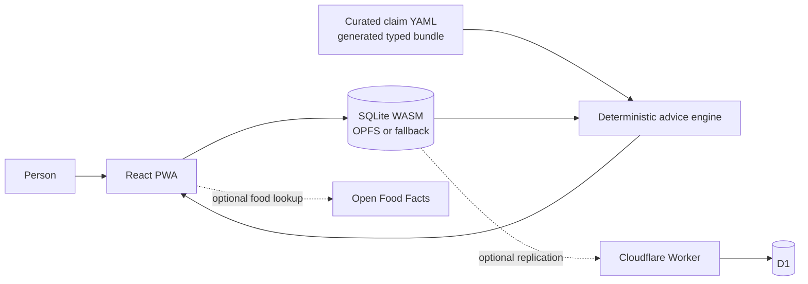

# MyoStat

MyoStat is a local-first strength and nutrition tracker that puts evidence-graded, citation-backed advice beside the decisions it informs. Recommendations come from a curated claim bundle, not generated text, and the interface is designed to show uncertainty instead of manufacturing precision.


## What works today

The implemented loop covers training, nutrition, bodyweight trends, deterministic advice, and weekly review, with optional Cloudflare Worker/D1 sync. Core records live in an on-device SQLite database and the advice surfaces retain structural provenance to their source claim.

The current scope is intentionally not described as finished:

- the bundled claim base contains 32 claims against the roughly 50-claim v1 requirement;
- Hevy CSV support is a tested parser, not a user-facing import flow;
- “delete all data” erases this device only and does not erase a configured sync server; and
- sync has contract and merge coverage, but no real browser-to-Worker/D1 round-trip test.

The dated, source-linked account of implemented, partial, and planned behaviour lives in the [feature status](docs/reference/feature-status.md). It owns mutable completion detail.

## Quick start

CI uses Node.js 24. From the repository root:

```bash
cd app
npm ci
npm run dev
```

The app works without a sync server. Worker/D1 setup is optional and documented separately in the [deployment guide](docs/guides/deployment.md).

## Architecture



SQLite on the device is the primary store. The sync service and Open Food Facts are optional network paths; the curated claim bundle is built ahead of time and the runtime advice path contains no LLM.

## Essential commands

Run these from `app/`:

| Command | Purpose |
| --- | --- |
| `npm run dev` | Start the Vite development server |
| `npm test -- --run` | Run the Vitest suite once |
| `npm run typecheck` | Type-check the app and tooling |
| `npm run build` | Type-check and produce the PWA build |
| `npm run e2e` | Run the Playwright suite |
| `npm run claims` | Regenerate the typed claim bundle from YAML |
| `npm run claims:audit-dois` | Audit claim DOIs against Crossref |

## Read next

- [Documentation home](docs/README.md) — four paths for product, engineering, evidence, and project history
- [Product overview](docs/product/overview.md) — audience, promise, and boundaries
- [System overview](docs/architecture/system-overview.md) — components and data flow
- [Development guide](docs/guides/development.md) — contributor setup and repository conventions
- [Requirements](docs/REQUIREMENTS.md) — normative requirement IDs and acceptance targets
- [Feature status](docs/reference/feature-status.md) — current implementation and known gaps

The hero above is the existing app icon, not a product screenshot. Task 8 owns the future reproducible, synthetic-data screenshot set described in the [screenshot asset guide](docs/assets/screenshots/README.md); until then, text and source remain authoritative.
