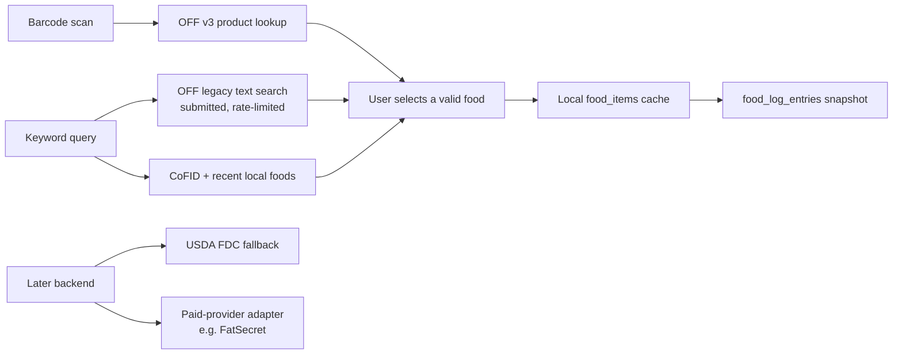

# Food Data Provider Research

**Status:** proposed launch decision, 2026-07-31  
**Scope:** UK-first food tracking, barcode lookup, keyword search, local-first PWA, free at launch, with a credible path to a commercial provider later.

## Recommendation

Launch with an **open-data composite**, not a single commercial provider:

1. **CoFID** remains the offline, UK-government source for common generic foods.
2. **Open Food Facts (OFF)** provides direct online lookup of packaged foods and barcodes, then the user-selected item is cached locally.
3. **USDA FoodData Central (FDC)** is the later free fallback for generic and US branded-food searches, accessed through a small server-side proxy after the product has a backend.

This is the closest viable free launch option for a UK PWA. It does **not** promise that every food will be found; no free provider can honestly make that promise. It gives the app the best practical coverage without exposing credentials, paying a licensing fee, or breaking its local-first/offline-repeat-use design.

For a paid, broader single-provider future, investigate **FatSecret Premier with the UK dataset** first. Do not commit to it until FatSecret confirms in writing that its licence permits this app's on-device caching and its deployment can satisfy the required proxy/IP configuration.

## Why There Is No Single Free "MyFitnessPal Database"

MyFitnessPal-like coverage means a mix of generic ingredients, branded packaged goods, supermarket products, restaurant foods, regional products, user-created foods, and barcode records. Those are different catalogues with different commercial rights. The free options trade breadth, regional coverage, permanence of storage, or client-side usability for cost.

| Candidate | Keyword search | Barcode lookup | UK / global branded coverage | Free production use | Fit for this PWA |
| --- | --- | --- | --- | --- | --- |
| CoFID | No broad live catalogue | No | UK generics | Yes | Excellent offline base, deliberately not exhaustive |
| Open Food Facts | Yes, legacy full-text API | Yes | Global community coverage; variable by brand/region | Yes, with attribution/share-alike obligations | Best direct, cacheable free packaged-food source |
| USDA FDC | Yes | Not a dedicated barcode product API | Strong generics and US-oriented branded data | Yes, API key required | Good later fallback via backend; not sufficient as UK barcode primary |
| FatSecret Basic / Premier Free | Yes | Basic: no; Premier Free: yes | Both free tiers are US-only | Yes, but approval/attribution conditions apply | Not a free UK source; browser-only use is not permitted |
| Edamam | Yes, including UPC/barcode | Yes | Commercial catalogue | Trial/free allowance may change; commercial terms apply | Not selected: needs credentials/backend and does not solve the free long-term requirement |
| Nutritionix | Yes | Yes | Primarily US branded/restaurant | Registered partners; public terms/pricing are not a dependable free launch commitment | Not selected: US-focused and commercial/partner dependency |

The table intentionally does not rank commercial databases by their claimed item count. A headline count is not evidence that a particular UK product, barcode, or nutritional label will be present and usable under this project's storage model.

## Provider Findings

### 1. Open Food Facts: launch online catalogue

OFF's product API is free to read and its database is available under the Open Database License. It is the only researched provider that is both practical for a client-side PWA today and compatible with persisting selected foods locally, provided the app shows the required attribution and follows the licence conditions. OFF itself warns that its contributor-supplied data may be inaccurate, incomplete, or absent; the app's existing parser correctly drops rows without calories or protein rather than inventing zeroes.

For API shape, use the current product endpoint for a scanned code, for example `GET /api/v3.6/product/{barcode}.json`. For keyword search, the current OFF documentation is unambiguous: v3 has no full-text search, v2 structured search is not plain-text search, and full-text remains the legacy `GET /cgi/search.pl` route. The proposed implementation is therefore:

- Barcode: current v3 product lookup.
- Keyword search: `GET /cgi/search.pl?search_terms=...&search_simple=1&action=process&json=1`, with a narrow field set where supported.
- Search interaction: submit/debounce conservatively; do not call the network for every keystroke. OFF permits 10 search requests/minute/IP and explicitly says not to use this for search-as-you-type. Local recents and CoFID results can still filter immediately while the user types.
- Product reads: cache only after the user chooses a result, not by bulk-prefetching search results.

Production obligations and limits:

- OFF requires attribution with a link to Open Food Facts and licence information; derivative database works have share-alike obligations.
- OFF sets 15 product reads/minute/IP and 10 searches/minute/IP. It asks apps to identify themselves with a custom User-Agent and to complete its API-usage form. Browsers cannot set the `User-Agent` request header themselves, so this is a known direct-PWA compliance limitation. Register the usage and, before traffic grows, move requests behind an app-owned proxy that sets the identifier.
- OFF says that not every product exists in its database. The product UI must preserve the current honest fallback: local recents/common foods and quick-add.

Sources: [OFF API overview and rate limits](https://openfoodfacts.github.io/openfoodfacts-server/api/), [OFF terms and reuse conditions](https://world.openfoodfacts.org/terms-of-use), [OFF data licensing](https://world.openfoodfacts.org/data).

### 2. USDA FoodData Central: free, authoritative fallback

FDC is free to use, publishes its data under CC0/public-domain terms, and offers keyword food search plus food-detail endpoints. It includes Foundation Foods, FNDDS, legacy Standard Reference, and the USDA Global Branded Foods Database. It is a strong complement for generic foods and US-branded gaps, not a reliable UK supermarket barcode substitute.

FDC is not appropriate for direct use from this client-only PWA: every request requires a data.gov API key, and USDA explicitly says key holders must not make that key public. Its default limit is 1,000 requests per hour per IP; higher limits require contact with FDC. Put it behind a small server-side endpoint when a backend exists. This makes the key private and lets the app apply provider ordering, caching, and abuse controls in one place.

Sources: [FDC API guide](https://fdc.nal.usda.gov/api-guide), [FDC OpenAPI specification](https://fdc.nal.usda.gov/api-spec/fdc_api.html).

### 3. FatSecret: possible paid future, not launch answer

FatSecret is the strongest researched candidate for a later commercial catalogue. Its marketing claims 2.3 million verified foods/products, 58+ country datasets, and 90%+ global UPC/EAN coverage. Its paid Premier tier exposes those regional datasets, autocomplete and barcode operations. Those claims make it worth evaluating once the app is online and funding/usage justify a paid service.

However, the free offer cannot supply the required UK experience:

- Basic is self-service and free, with 5,000 calls/day, but is US-only, English-only, and excludes barcode scanning and autocomplete.
- Premier Free requires verification and is only for qualifying startups, nonprofits, or student/research groups. It adds barcode and autocomplete but remains US-only. A non-US dataset is an unpublished paid/discounted arrangement, not a free entitlement.
- Every FatSecret request must be signed using a client/consumer secret. Its OAuth documentation requires a proxy server for token requests and credentials must stay off individual devices. This PWA therefore needs a backend and stable proxy/IP arrangement before it can use FatSecret properly.
- FatSecret's storable-data guidance allows IDs indefinitely but does not list food names, macros, barcode responses, or autocomplete results as indefinitely storable. The same documentation says other data must be removed or re-requested within 24 hours. That conflicts with the product's permanent on-device cache of selected foods. The editions page mentions caching for Premier Free/Premier, but the public storage guide does not state that it authorises an offline food catalogue. Obtain explicit written permission before relying on it.
- FatSecret's terms prohibit using its API content to provide diet, nutrition, or health advice/guidance/diagnosis. If adopted, its data should remain isolated to food lookup/logging; the app's evidence-graded advice must continue to use its independently sourced claim system.

Sources: [FatSecret editions and eligibility](https://platform.fatsecret.com/api-editions), [authentication requirements](https://platform.fatsecret.com/docs/guides/authentication), [barcode endpoint](https://platform.fatsecret.com/docs/v2/food.find_id_for_barcode), [storable-data policy](https://platform.fatsecret.com/docs/guides/storable-data), [localization](https://platform.fatsecret.com/docs/guides/localization).

### 4. Edamam and Nutritionix: capable but not the free, UK-first answer

Edamam's Food Database API documents keyword/name/UPC-barcode search and detailed nutrition data. It is a B2B credentials-based API, so it also needs a backend for a public app. It may be a good paid benchmark later, but its commercial terms and free allowance are not a stable foundation for the stated "free until launch" requirement.

Nutritionix documents autocomplete and an item endpoint for UPC lookup, but it is oriented around its commercial/registered-partner API. Its public site now directs developers to partner access and bulk database licensing. It is also principally a US branded/restaurant dataset, so it is not a good UK-first launch provider.

Sources: [Edamam Food Database API](https://developer.edamam.com/food-database-api-docs), [Nutritionix v2 endpoints](https://developer.nutritionix.com/docs/v2), [Nutritionix business access](https://www.nutritionix.com/business/api).

## Launch Architecture

The important boundary is that a network provider returns a normalized food draft. Database writes and meal logging do not know or care which provider produced it.

## Can We Switch Providers Later?

Yes. The current persistence model makes this much less risky than it first appears:

- `food_log_entries` snapshot the name, quantity, calories, protein, carbs, and fat at logging time. Replacing or removing a catalogue provider cannot rewrite historical diary entries.
- `food_item_id` is optional, so quick-add and old entries remain valid even if a catalogue item disappears.
- `food_items` already records `source`; CoFID and OFF can coexist.

The first multi-provider implementation should make two small, deliberate changes:

1. Define a `FoodProvider` network-boundary interface: `search(query)` and `lookupBarcode(barcode)` return the normalized food-draft shape. Keep provider-specific fetch, credentials, field parsing, and ranking inside adapters.
2. Add a provider-qualified external ID to `food_items`, with a uniqueness constraint on `(source, provider_item_id)`. A barcode alone is not sufficient identity across provider catalogues or for generic foods without barcodes.

Do not migrate existing food logs when switching. The new provider only changes future lookup/caching behaviour. Source attribution should remain attached to each cached item, and the UI should say which source supplied the selected food.

## Decision Needed Before Implementing Task 6

Proceed with the existing OFF implementation, amended as follows:

1. Implement OFF barcode lookup on the v3 product endpoint.
2. Implement the legacy OFF full-text endpoint for keyword search, with explicit submit/conservative debounce and client-side rate limiting.
3. Keep the selected-item cache and the CoFID/quick-add offline fallbacks.
4. Add a brief production note to revisit OFF through a proxy when this app is deployed and traffic is meaningful.

This gives the project barcode lookup and broad free search now, while keeping a clean technical and commercial upgrade route later.

