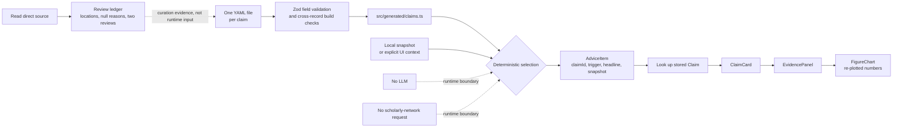

# Advice engine and evidence trust path

MyoStat does not write advice at runtime. It selects from versioned claim
records and renders the selected record at its stored evidence grade. Advice on
an evidence card can be traced to a `claim_id`; its grade and citations come
from that same record.



The solid runtime path begins at the committed generated bundle. Crossref,
PubMed, publisher sites, and the review ledger belong to curation, not app
execution. There is no LLM or scholarly-network request in the runtime trust
path, so selection remains deterministic and offline.

Structural validation is necessary, but it is not a literature review. It can
prove that a DOI has the right shape and that records agree with one another;
it cannot prove that a paper supports the statement or that review is complete.
The current ledger is mixed: some records have direct-source reviews, while
historical records remain `pending-M6-review`. See the
[curation guide](../guides/evidence-curation.md) for the review process.

## Claim record

The contract is `Claim` in [`types.ts`](../../app/src/advice/types.ts), enforced
for YAML by [`claim-schema.ts`](../../app/src/advice/claim-schema.ts).

| Field | Meaning and enforced boundary |
| --- | --- |
| `id` | Permanent lowercase `c-...` id; the filename must be `<id>.yaml`. This is the provenance key. |
| `statement` | Non-empty full claim shown by `ClaimCard`; confidence wording is not authored here. |
| `peekStatement` | Complete curated short form for the workout peek, 1–100 characters. It is never an automatic truncation. |
| `grade` | `A`, `B`, `C`, or `D`, using the [evidence rubric](../00-meta/evidence-standards.md). It drives confidence language. |
| `status` | `settled` or `contested`. A contested claim must name a cluster. |
| `domain` | Non-empty grouping/search tag such as `volume`; numbers-hidden filtering also uses it. |
| `predicates` | Restricted [JSON Logic](json-logic.md), or `null` for no snapshot-triggered route. Null does not prevent search or an authored surface context. |
| `trigger` | `rule`, `data-earned`, or `null`; null exactly when `predicates` is null. `data-earned` is reserved for context established by reliable logs. |
| `surfaceContexts` | General-evidence placements, or `null`: `hub-empty`; exercise selection with optional known exercise ids/populations; or goal draft with distinct known goals. This is metadata, not a personal predicate. |
| `clusterId` | Shared non-empty id for opposing contested claims; otherwise `null`. Only contested claims may carry one, and the cluster needs at least two records. |
| `phrasingKey` | Required stable slug. The current `renderHeadline` does not branch on it; it uses the stored statement and grade. |
| `supersededBy` | Replacement claim id, or `null`. The target must exist and cannot be self. The panel displays it, but current selectors do not exclude it automatically; the current bundle has no links. |
| `lastReviewed` | Real `YYYY-MM-DD` date of the last human evidence review, not an edit timestamp. The panel displays it. |
| `citations` | One or more citation records. Zero-citation claims are rejected. |

`surfaceContexts` accepts these authored shapes:

```yaml
surfaceContexts:
  - surface: hub-empty
  - surface: exercise-selection
    exerciseIds: [barbell-bench-press] # optional; seed ids only
    populations: [trained]             # optional
  - surface: goal-draft
    goals: [bulk, maintain]
```

Omitting `exerciseIds` makes an exercise context general. A `data-earned` claim
cannot carry general surface contexts. Unknown surfaces, exercises, goals,
empty lists, and duplicate goal entries are rejected.

## Citation and figure records

Each `Citation` stores bibliographic identity and only the detail established
from a source the curator actually read.

| Field | Meaning and null behavior |
| --- | --- |
| `id` | Non-empty id, unique within its parent claim. |
| `claimId` | Must exactly equal the parent claim's `id`. |
| `doi` | Bare DOI shaped `10.<registrant>/<suffix>`. Shape validation is not resolution or proof of support. |
| `authors` | Non-empty stored author string. Cards shorten long lists; the panel shows the full value. |
| `year` | Integer 1900–2100; use the journal issue year described by the schema guide. |
| `journal` | Non-empty journal name. |
| `n` | Positive integer, or `null` when not stated in a source read. The UI says “not stated in source.” |
| `population` | `trained`, `untrained`, `mixed`, or `unstated`. `unstated` means the readable source did not identify it; it does not mean mixed. |
| `effectSize` | Non-empty source-grounded text, or `null` when not extractable. The UI says “not extracted from source.” |
| `ci` | Non-empty reported interval text, or `null` under the same source-read rule. |
| `figures` | Extracted numeric values. An empty array means none are stored. Publisher figure images are never stored or embedded. |
| `quote` | Short non-empty attributed excerpt, or `null`; a null quote is omitted. |

A figure is `{ label: string, value: number, unit?: string }`; labels and present
units must be non-empty. `FigureChart` groups two or more commensurable values
by unit on a zero-inclusive axis. Single or unitless values stay as readable
numbers. These are MyoStat re-plots, not publisher graphics.

For `n`, `effectSize`, `ci`, and `quote`, `null` always means “not established
from a source I actually read.” It never means zero, no effect, or safe to
infer. Record the reason in the ledger. The same honesty applies to
`population: unstated`.

## Build gates

The build parses every `app/claims/*.yaml`, validates each record, then checks
the corpus. It rejects malformed fields, filename/id disagreement, duplicate
claim ids, duplicate citation ids within a claim, wrong citation parents,
missing/self supersession targets, settled claims with a cluster, and contested
claims without an opposing cluster member.

Output is sorted by claim id and written to
[`src/generated/claims.ts`](../../app/src/generated/claims.ts). A drift test
regenerates in memory and compares the exact module text.

## Four selection routes

Every route returns an `AdviceItem`: `claimId`, an honest trigger, a
grade-calibrated headline, and a snapshot. Selection chooses a stored claim; it
never authors a citation or substitutes free text for one.

### 1. Keyword question search

**Input:** the user's query and generated claims. MiniSearch indexes `statement`
and `domain` only—not citation text. It uses prefix matching, fuzzy distance
`0.2`, and requires every query term to match. Results use trigger `query`,
`EMPTY_SNAPSHOT`, and the same `renderHeadline` as automatic advice. A matched
contested claim brings in every sibling; the UI groups them into one both-sides
card.

Blank or unmatched input returns nothing. This explicit route does not apply
cooldown, suppression, or numbers-hidden filters, and `AskEvidence` does not
currently record an advice event. Provenance is the returned `claimId`.

### 2. Snapshot predicate evaluation

**Input:** a consent-backed `UserStateSnapshot` and generated claims. It includes
goal, deficit duration, weight/e1RM trends, weekly muscle sets, nullable protein
per kg, and numbers-hidden state. The engine derives `muscleSets` for scoped
`some` rules.

Null predicates/triggers are skipped. Other predicates are revalidated,
evaluated, and accepted only when JSON Logic returns literal `true`. A matching
contested claim expands to its whole cluster. Results keep the authored `rule`
or `data-earned` trigger and actual snapshot.

On the Hub, suppressed and recently shown ids are removed. Numbers-hidden mode
also removes `energy-balance`, `protein-dose`, and `protein-timing`. The public
evidence base remains browseable. No consent-backed snapshot means no personal
selection; no logged data may instead permit the separate `hub-empty` route.

False, malformed, throwing, or merely truthy rules produce silence. Hub rule
cards consult cooldown history but do not currently record their own display,
so a Hub view alone does not start a cooldown; the `hub-empty` card does.

### 3. One-per-session snapshot advice

**Input:** snapshot evaluation plus suppressed ids, seven-day cooldown ids, and
whether the workout already spent its slot. Both `rule` and `data-earned`
candidates use this route; the latter is provenance, not a separate evaluator.

At workout opening, candidates pass numbers-hidden, suppression, and cooldown
filters. If several remain, grade is the only ordering: A before B before C
before D. Selection runs once, never after each set. The app records claim id,
trigger, workout id, and `workout-start` before showing the peek. A supported
`whyNow` line may state the matching logged e1RM or volume fact, never a second
recommendation.

Workout opening and first exercise selection share one serialized, at-most-one
card lane. Missing snapshot, spent slot, blocked candidates, or storage failure
means silence—there is no filler.

The evaluator expands contested siblings, but `selectSessionAdvice` returns one
item and `AdvicePeek` renders one claim. Unlike Hub/search, this route does not
currently preserve a both-sides cluster presentation.

### 4. General surface-context selection

**Input:** `hub-empty`, `exercise-selection`, or `goal-draft` context plus
suppressed and recent ids. Only claims with null predicate and trigger qualify,
so UI context cannot masquerade as a personal conclusion.

For exercise selection, an exact exercise outranks a general context. A matching
population breaks an otherwise equal tie: `new` maps to `untrained`,
`experienced` to `trained`; `returning` and missing experience map to neither.
A mismatch does not exclude a general claim. Goal contexts require the current
goal. Grade is not a rank here.

Suppressed and cooling-down claims are removed. Unknown exercise, no match, or
equal top ranks returns `null`: ambiguity ties to silence instead of array
order. The result uses `surface-context` and `EMPTY_SNAPSHOT`; the caller records
the claim and surface. Numbers-hidden state is not an input, so the shared
domain filter applies to snapshot routes, not this one.

## Rendering and event provenance

`renderHeadline` joins the stored statement to grade-derived language: A is
well-supported, B carries real uncertainty, C is limited evidence, and D is
anecdotal. Feature components do not hard-code DOI or grade prose.

The UI resolves `AdviceItem.claimId` back to the bundle. `ClaimCard` shows the
statement, grade treatment, and first source; `EvidencePanel` adds confidence,
review/supersession metadata, citations, quotes, and disclosures; `FigureChart`
shows explicit missing-data language and re-plotted values.

Where the calling surface records a display, `advice_events` stores claim id,
trigger, surface, and shown time. These events implement the seven-day cooldown
and durable suppression. Suppression affects automatic selection, not explicit
browse/search; the Hub rule-card exception is noted above.

Tests enforce key boundaries: no hard-coded DOI/grade prose in features, no
publisher images in components, no network/LLM in advice, and a non-empty
`data-claim-id` ancestor for every rendered claim statement.

See [JSON Logic](json-logic.md) for the predicate language and
[evidence curation](../guides/evidence-curation.md) for how sources become YAML.
