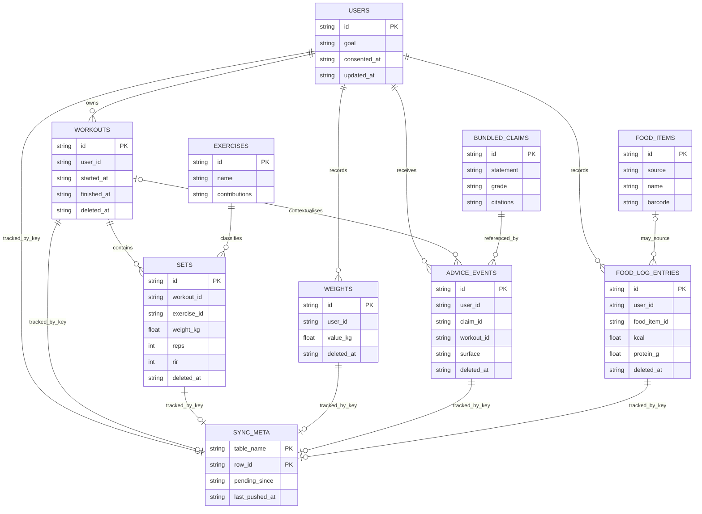

# Data model

**Status:** Current schema reference. [`schema.ts`](../../app/src/db/schema.ts) is the Drizzle contract; the ordered [SQL migrations](../../app/src/db/migrations/) are the executable history for existing installs.

MyoStat has **nine product tables** in local SQLite. A tenth internal table, `_migrations`, records migration bookkeeping and is documented separately below. The generated evidence claim bundle is application data, not an SQLite table.

## Local relationships

These are logical application relationships. The migrations do not declare SQL foreign-key constraints, so data-access code is responsible for creating and querying consistent identifiers.



`BUNDLED_CLAIMS` is drawn only to make the `advice_events.claim_id` relationship visible. It represents [`generated/claims.ts`](../../app/src/generated/claims.ts), built from authored [claim YAML](../../app/claims/); it is **not** one of the nine SQLite tables. Likewise, `sync_meta` uses `(table_name, row_id)` as an application-level polymorphic key rather than a foreign key. A reserved `(__sync__, watermark)` row has no product-row relationship.

## The nine product tables

| Table | Purpose and key fields | Important nullable semantics | Replicated? |
| --- | --- | --- | --- |
| `users` | One fixed `local-user` row per install. Stores consent, goal and goal clock, profile, numbers-hidden preference, and guarded nutrition targets. `updated_at` is the sync merge timestamp. | `consented_at = null` means logging consent has not been recorded. Height, birth year, targets, `goal_started_at`, and training experience may be unknown or not set; none should be read as zero. | Yes |
| `exercises` | Bundled exercise catalogue: name, modality, compound flag, and JSON muscle-contribution map. | No nullable fields. | No — build-time reference seed |
| `workouts` | Session owner, start, optional name, finish time, update time, and tombstone. | `name = null` is unnamed. `finished_at = null` defines an open session. `deleted_at = null` is live. | Yes |
| `sets` | Workout and exercise identifiers, load, reps, optional RIR, working/warmup type, performed/update times, and tombstone. | `rir = null` means not recorded, especially for imported data; it is not RIR 0. `deleted_at = null` is live. | Yes |
| `weights` | User, measured bodyweight, measurement time, update time, and tombstone. | `deleted_at = null` is live. | Yes |
| `advice_events` | Provenance and presentation history: user, required claim id, trigger, optional workout, surface, shown/dismissed/suppressed times, update time, and tombstone. | `workout_id = null` means the advice was outside a workout. Dismissal and suppression are separate optional events. Historic rows may use surface `unknown`; new writes must name a real surface. | Yes |
| `food_items` | Local food catalogue/cache with provenance source, optional brand/barcode/serving metadata, per-100 g macros, and update time. Contains seeded CoFID rows and saved Open Food Facts results. | Brand, barcode, fibre, serving grams, and serving label may be absent. Required energy/protein/carbohydrate/fat values are never filled with invented zeroes. | No — reference/cache data |
| `food_log_entries` | User meal record with optional food-item source, entered quantity, and the macros as logged. Carries update time and tombstone. | `food_item_id = null` is a first-class quick-add. Quantity may be approximate or absent. Carbohydrate/fat may be absent; required kcal/protein remain explicit. | Yes |
| `sync_meta` | Local pending queue keyed by `(table_name, row_id)`, plus the reserved server-sequence watermark row. | `pending_since = null` means not queued. For product-row records, `last_pushed_at` is an ISO push time; on the reserved watermark row it holds the server sequence as a numeric string. | No — local replication bookkeeping |

### Migration bookkeeping

`_migrations` is created by [`runMigrations()`](../../app/src/db/migrate.ts), outside the Drizzle product schema. Its `name` primary key and `applied_at` timestamp record which of the six named migrations have committed. It is not product data and does not replicate.

## Denormalisation and references

- `food_log_entries` deliberately copies the food name and logged macro values. A past meal remains what the person recorded even if the catalogue row is later corrected, replaced, or unavailable.
- `food_item_id` is therefore a useful optional provenance link, not the source of historical macro truth.
- `exercises.contributions` stores a JSON muscle-to-fraction map because it is read as one catalogue property. Sets retain only `exercise_id`.
- `advice_events.claim_id` points into the build-time claim bundle. Claims, citations, grades, and predicates are versioned with the application rather than copied into every local database.
- The singleton user and relationship identifiers are not enforced by SQLite foreign keys. [`user.ts`](../../app/src/db/user.ts), [`workouts.ts`](../../app/src/db/workouts.ts), [`nutrition.ts`](../../app/src/db/nutrition.ts), and [`advice-events.ts`](../../app/src/db/advice-events.ts) own those invariants.

## Tombstones and erasure

The five replicated row types that support normal deletion — `workouts`, `sets`, `weights`, `advice_events`, and `food_log_entries` — carry a nullable `deleted_at` tombstone. A normal replicated deletion is represented by retaining the row, setting `deleted_at`, advancing `updated_at`, and queuing the change. A hard delete would give another device nothing to pull, so the tombstone travels like any other last-write-wins update.

`users` has no local `deleted_at`; it is the singleton identity row, not a normal tombstone candidate. The local “delete everything” flow is deliberately different: it hard-deletes the six user-data tables on that device and recreates an empty, unconsented user. That flow is not a cross-device deletion protocol and currently has no server-erasure propagation. See [`export.ts`](../../app/src/db/export.ts) and [safety and privacy](../product/safety-privacy.md).

## Local versus remote schema

Exactly six local tables replicate:

```text
users · workouts · sets · weights · advice_events · food_log_entries
```

The allowlist lives in the shared [sync protocol](../../app/src/sync/protocol.ts). `exercises` is a shipped reference catalogue, `food_items` is reference/cache data, and `sync_meta` is the replication mechanism's own queue and watermark; sending any of them would either move non-user catalogue data or attempt to sync the queue through itself. `_migrations` and the bundled claims are also outside replication.

For each of the six replicated table names, [D1](../../app/server/schema.sql) stores the same five-column envelope:

| Remote column | Meaning |
| --- | --- |
| `id` | Stable local row identifier and primary key |
| `updated_at` | Device-authored ISO timestamp used for last-write-wins comparison |
| `deleted_at` | Nullable tombstone; the client sends null for the local `users` row |
| `data` | Opaque JSON string containing the complete local row in camelCase |
| `server_seq` | Server-owned sequence assigned to the accepted write batch and indexed for pulls |

Keeping row content opaque avoids a D1 migration every time a local table gains a column. The trade-off is intentional: D1 is a replication target, not an analytics or query surface, so the server cannot efficiently filter or aggregate fields inside `data`. The top-level id, timestamps, tombstone, and sequence are the only fields the replication algorithm needs.

`updated_at` and `server_seq` solve different problems. Conflict resolution remains last-write-wins on `updated_at`, with a canonicalised-content tie-break when timestamps match. Pull delivery uses `server_seq > since`, because a server-owned monotonic sequence cannot skip a slow-clock device's write. Accepted rows in one batch share a sequence, and the response watermark advances only through rows that response accounts for. See the [server merge](../../app/server/src/sync.ts), [client merge](../../app/src/sync/merge.ts), and [queue/watermark code](../../app/src/sync/queue.ts).

The remote database also has `sync_state` for the sequence counter and `food_search_limits` for the search proxy's coarse rate-limit window. Neither is a replica of local health data.

Contract, merge, queue, and Worker behavior are unit-tested, but there is currently no browser-to-deployed-Worker/D1 round-trip test. The [sync page](sync.md) owns the detailed protocol and failure behavior.
