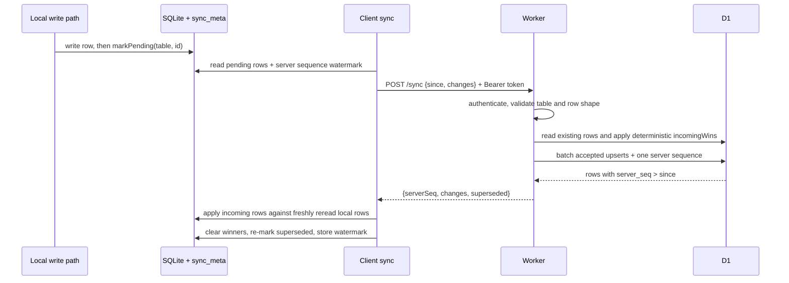

# Sync architecture

Sync is optional replication: local SQLite remains the source of truth and an
unconfigured app stays fully local. Six user-data tables replicate through one
authenticated `POST /sync`; reference catalogues and `sync_meta` do not.

## Conflict and failure rules

| situation | deterministic result |
| --- | --- |
| No existing row | Incoming row wins. |
| Different `updatedAt` | Lexically later ISO timestamp wins. This timestamp orders versions; the server-owned sequence orders pulls. |
| Equal timestamp, different content | Recursively canonicalised full-row content breaks the tie, so client and server choose the same arbitrary winner. |
| Equal timestamp, identical content | No conflict and no replacement. |
| Soft delete | `deletedAt` travels as a tombstone and wins by the same rule. Hard deletion is not replicated. |
| Edit while request is in flight | Pull merge rereads the local row before comparing, protecting a newer local edit. |
| Network, non-2xx, or error body | The attempt throws; pending rows and watermark remain unchanged. |
| Concurrent manual/reconnect calls | All callers share one in-flight promise; rows are not pushed twice. |
| Server rejects an older local row | It is returned in `superseded` and remains pending for a later reconciliation attempt. |
| Connectivity returns | One `online` listener starts best-effort sync; there is no polling or background-sync claim. |

Accepted writes and the `sync_state` update use one D1 batch. All winners in the
batch share a sequence, and pulls filter on `server_seq > since`; a response only
advances to the highest sequence it accounts for.

Primary contracts: [protocol](../../app/src/sync/protocol.ts),
[queue](../../app/src/sync/queue.ts), [local merge](../../app/src/sync/merge.ts),
[client orchestration](../../app/src/sync/sync.ts), and
[Worker merge](../../app/server/src/sync.ts). Tests cover both sides, including
tombstones, clock-independent watermarks, racing edits, failures, and auth:
[client tests](../../app/src/sync/sync.test.ts) and
[Worker tests](../../app/server/src/index.test.ts).

Known boundaries: no deployed browser-to-Worker/D1 end-to-end test exists, and
“delete all my data” erases only the current device; there is no server-erasure
endpoint. See [deployment](../guides/deployment.md) and
[feature status](../reference/feature-status.md).
