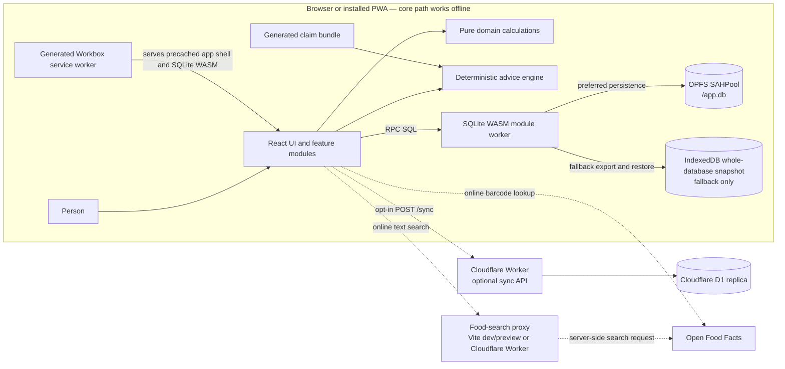

# System overview

**Status:** Current implementation map. Runtime source, migrations, and tests take precedence over this explanation if they diverge.

MyoStat is a local-first React PWA. The browser-side SQLite database is the primary store, including when optional sync is configured. Core logging, trends, and deterministic advice do not need a network connection. Network access adds cross-device replication and Open Food Facts discovery; it is not in the local write path.

## System context

The solid paths inside the device are the normal offline-capable path. The dotted paths require a network connection:

- Sync is opt-in. Without a URL and bearer token, the client remains local-only and does not arm its reconnect listener. See the [sync client](../../app/src/sync/sync.ts) and [runtime configuration](../../app/src/sync/config.ts).
- Text food search uses `/api/food/search`. Vite supplies the proxy in development and preview; the optional Cloudflare Worker supplies the deployed equivalent. Barcode lookup calls the Open Food Facts product API directly. Both are live discovery paths; bundled CoFID foods and previously saved food items remain available locally. See the [Open Food Facts client](../../app/src/food/off.ts), [Vite proxy](../../app/vite.config.ts), and [Worker routes](../../app/server/src/index.ts).
- The service worker is generated by `vite-plugin-pwa`, not handwritten. Its Workbox manifest includes the app shell, JavaScript, CSS, images, SVG, and the SQLite `.wasm` asset, so an already installed and controlled build can boot offline. See [PWA registration](../../app/src/pwa.ts), [build configuration](../../app/vite.config.ts), and the [offline browser test](../../app/e2e/offline.spec.ts).

## Boot sequence

1. [`main.tsx`](../../app/src/main.tsx) applies the stored theme, registers the PWA service worker immediately, and renders `App`.
2. `App`'s shell starts [`initDb()`](../../app/src/db/client.ts). Concurrent callers share the same in-flight promise, including React StrictMode's repeated development effect.
3. `initDb()` creates a module Web Worker and sends an `init` request through the small [RPC layer](../../app/src/db/rpc.ts).
4. The [SQLite worker](../../app/src/db/sqlite.worker.ts) loads SQLite WASM, tries the OPFS SAHPool, and opens `/app.db`. If SAHPool installation is unavailable or its pool lock cannot be acquired, it opens `:memory:` and attempts to restore the last fallback snapshot from IndexedDB.
5. Back on the client, [`runMigrations()`](../../app/src/db/migrate.ts) applies missing SQL migrations in order. [`seedExercises()` and `seedFoods()`](../../app/src/db/seed.ts) then repair or upsert the two reference catalogues.
6. Only after migration and seeding does the client construct the Drizzle SQLite proxy. Drizzle calls are translated into worker RPC executions; application code never opens a second main-thread SQLite connection.
7. The shell records the returned storage mode, starts optional auto-sync after the database is ready, and shows a visible data-loss warning for every mode other than `opfs-sahpool`.

Migration or seed failure rejects boot and clears the cached initialization state; it is not presented as a successful database start. The detailed persistence behavior, including fallback snapshot timing, is in [local-first storage](local-first-storage.md).

## Responsibility boundaries

| Boundary | Owns | Does not own |
| --- | --- | --- |
| React features | Routes, input, rendering, and orchestration | Storage engines, evidence grading, or safety policy |
| `src/db/` | Worker transport, schema contract, migrations, seeds, and local data access | Remote replication policy |
| `src/domain/` | Framework-free calculations and harm guards | UI state or persistence |
| `src/advice/` | Deterministic snapshot, predicate, search, and selection logic | Runtime claim authoring or generated prose |
| Generated claim bundle | Build-time validated statements, grades, and citations | SQLite persistence; claims are not a database table |
| `src/sync/` | Opt-in queue, wire contract, merge, and watermark logic | Primary storage; D1 is a replica |
| `server/` | Authenticated sync and proxied food search | Core offline operation |

The deterministic advice path joins local snapshots with the generated claim bundle. There is no runtime model or LLM in that path. See [advice engine](advice-engine.md), [data model](data-model.md), and the [repository map](../reference/repository-map.md).
